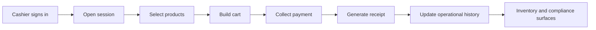
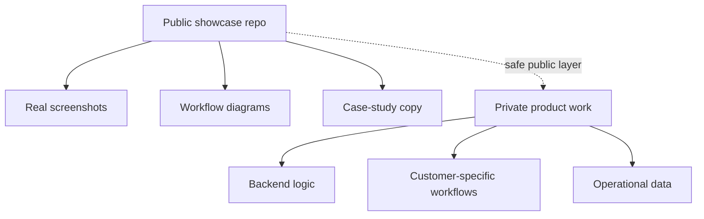

# NerdPOS Showcase

Public-safe case study and screenshot showcase for an Arabic-first POS product direction.

This repo exists to show the product surface clearly without exposing private backend logic, production data, or business-sensitive implementation details.

## What this showcase covers

- Cashier order-building flow
- Payment collection flow
- Receipt preview with QR/invoice surface
- Inventory dashboard direction
- Compliance-facing dashboard direction

## Why this repo exists

Some business software work should not be published as raw source code. This repo is the public layer for demonstrating the interface quality, workflow depth, and product direction behind NerdPOS.

The screenshots were captured from a safe frontend-only copy. No private backend code, customer data, or secrets are included here.

## Product focus

NerdPOS is positioned around:

- Arabic-first cashier workflows
- Inventory visibility
- Compliance-aware operations
- Practical business UX for real teams

## Workflow map

## Showcase boundary

## Screenshot gallery

### Live POS order build

Shows an active session, product selection, cart state, tax calculation, and checkout action.

### Payment collection

Shows the cash payment flow in progress inside the POS checkout experience.

### Receipt preview

Shows the generated receipt preview with totals, tax, payment method, and QR/invoice surface.

### Inventory dashboard

Shows the inventory-facing operational screen for stock visibility and control workflows.

### Compliance dashboard

Shows the compliance-oriented interface direction for invoice and submission workflows.

## Public vs private boundary

Public here:

- Screenshots
- Product framing
- Safe case-study narrative
- UI direction

Private by design:

- Production backend logic
- Customer-specific workflows
- Sensitive ERP/POS implementation details
- Operational or financial data

## Related public repos

- [nerd-pos](https://github.com/KareemQabil/nerd-pos)
- [nerdERPs](https://github.com/KareemQabil/nerdERPs)
- [KareemQabil](https://github.com/KareemQabil)
