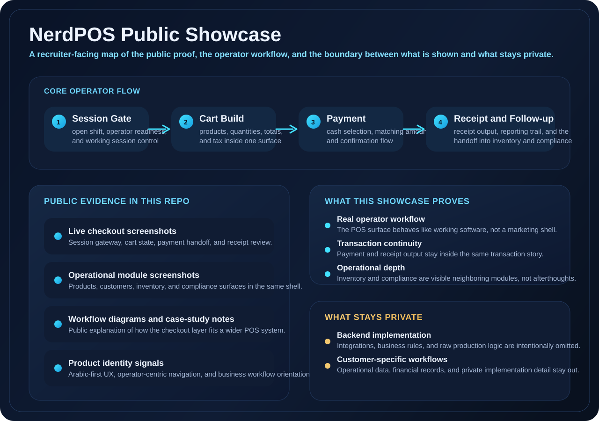
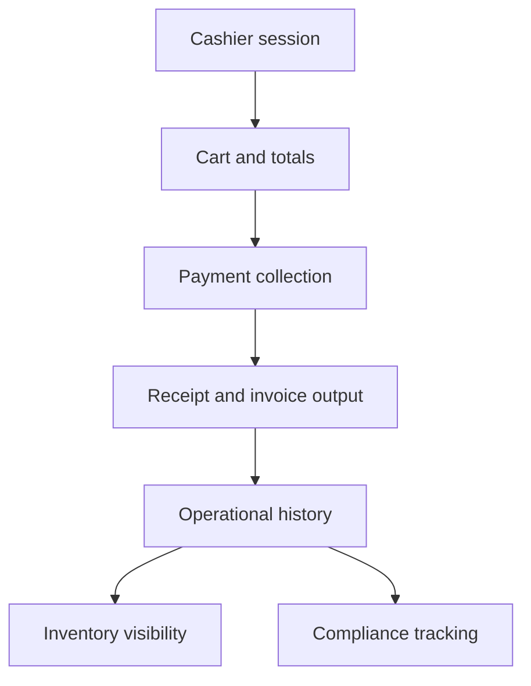
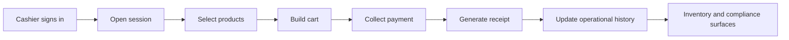
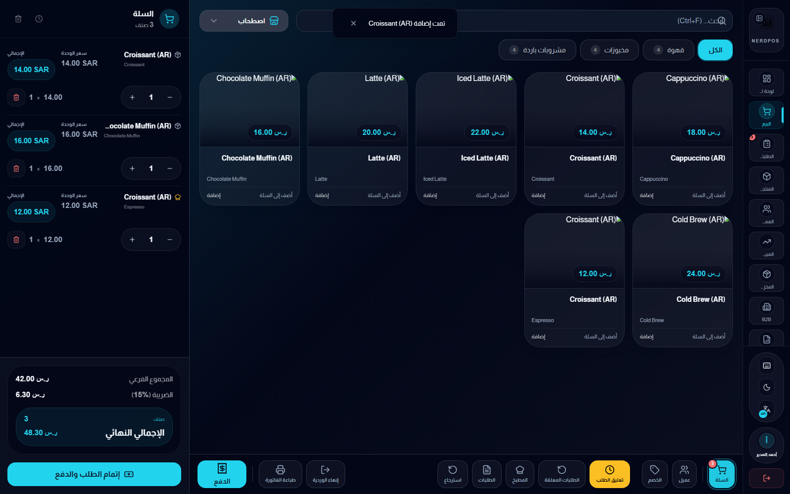
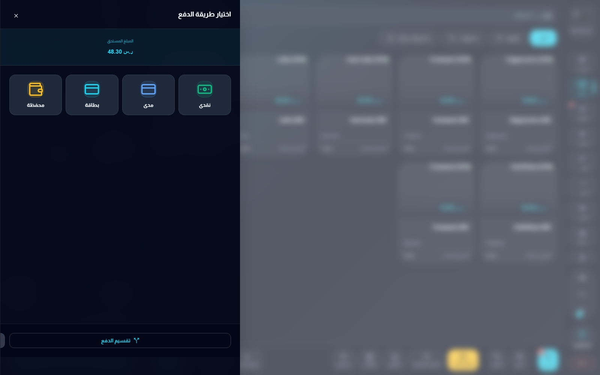
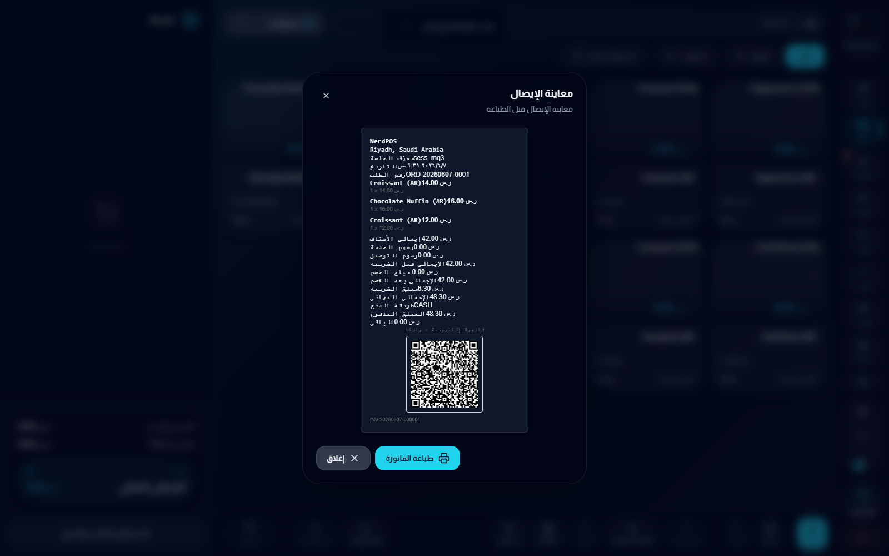
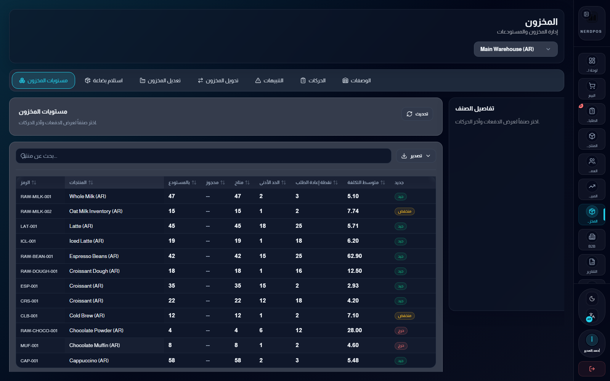
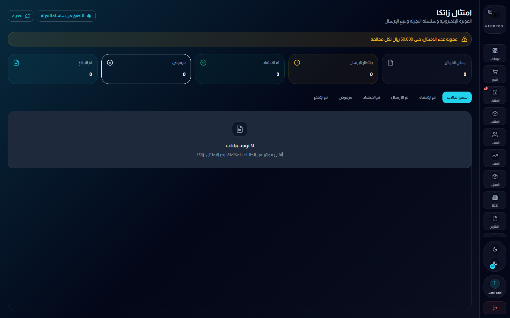
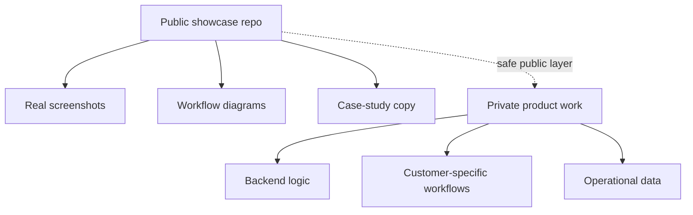

# NerdPOS Showcase

Public-safe case study and screenshot showcase for an Arabic-first POS and operations product direction.

This repo exists to show the product surface clearly without exposing private backend logic, production data, or business-sensitive implementation details. The screenshots were captured from a safe frontend-only copy, and the case-study framing is designed to communicate product depth in a recruiter-friendly way.

## Supporting docs

- [Workflow notes](docs/workflow-notes.md)
- [Public release notes](docs/public-release-notes.md)

## What this showcase covers

- Cashier order-building flow
- Payment collection flow
- Receipt preview with QR or invoice surface
- Inventory dashboard direction
- Compliance-facing dashboard direction
- Public explanation of how these surfaces fit into a broader ERP or POS workflow

## Problem the product is addressing

NerdPOS is aimed at the practical problems that make retail and back-office operations messy:

- slow cashier flows that force too many clicks or context switches
- weak handoff between order capture, payment, and receipt output
- inventory surfaces that are disconnected from daily selling activity
- compliance workflows that appear bolted on instead of operationally integrated
- Arabic business environments that are treated as a localization afterthought

## Who this product is for

- cashiers who need speed, clarity, and low-friction checkout
- supervisors who need a clear view of active sessions, receipts, and exceptions
- inventory or operations staff who need stock-facing visibility after sales activity
- compliance-facing operators who need invoice and submission status to be legible

## Why this repo exists

Some business software work should not be published as raw source code. This repo is the public layer for demonstrating the interface quality, workflow depth, and product direction behind NerdPOS.

The screenshots were captured from a safe frontend-only copy. No private backend code, customer data, or secrets are included here.

## Product focus

NerdPOS is positioned around:

- Arabic-first cashier workflows
- inventory visibility
- compliance-aware operations
- practical business UX for real teams

## Module map

| Surface | What it represents |
| --- | --- |
| Cashier session | Opening a working session and moving into live selling activity |
| Cart and totals | Item selection, quantity handling, taxes, and order summary |
| Payment collection | Payment method choice, amount handling, and confirmation |
| Receipt output | Receipt review, totals confirmation, and QR or invoice framing |
| Inventory view | Stock visibility connected to the sales operation layer |
| Compliance view | Invoice or submission-oriented operational follow-up |

## System map

## Workflow map

## What the evidence proves

- The cashier surface is not a mock landing page. It includes product selection, cart state, tax and totals, and payment transition.
- The payment flow is part of the same operational thread, not a disconnected popup.
- Receipt output is treated as a real workflow surface with totals and QR or invoice framing.
- Inventory and compliance are presented as adjacent operational modules rather than afterthoughts.
- The public proof is interface- and workflow-oriented, not just a generic screenshot dump.

## Screenshot gallery

### Live POS order build

Shows an active session, product selection, cart state, tax calculation, and checkout action.

### Payment collection

Shows the cash payment flow in progress inside the POS checkout experience.

### Receipt preview

Shows the generated receipt preview with totals, tax, payment method, and QR or invoice surface.

### Inventory dashboard

Shows the inventory-facing operational screen for stock visibility and control workflows.

### Compliance dashboard

Shows the compliance-oriented interface direction for invoice and submission workflows.

## Engineering signals visible from the public layer

- checkout is treated as a multi-step workflow, not a single-screen toy example
- receipt and compliance are first-class workflow surfaces instead of decorative extras
- the product direction assumes adjacent operational modules beyond the cashier screen
- Arabic-first product handling is part of the system identity, not a thin translation pass

## Showcase boundary

## Why this matters publicly

For business software, raw code is not always the best public proof. A stronger public signal is often:

- honest screenshots
- clear workflow explanation
- system boundaries stated explicitly
- product thinking shown without leaking private implementation

## Public vs private boundary

Public here:

- screenshots
- product framing
- safe case-study narrative
- UI direction

Private by design:

- production backend logic
- customer-specific workflows
- sensitive ERP or POS implementation details
- operational or financial data

## What can be added later

Future public-safe additions can include:

- architecture notes around the POS and operational module boundaries
- sanitized flow writeups for reporting and inventory handoff
- more screenshots where they strengthen the story without exposing IP

## Related public surfaces

- Main profile: [KareemQabil](https://github.com/KareemQabil)
- Portfolio: [kerimqabil.me](https://kerimqabil.me)
