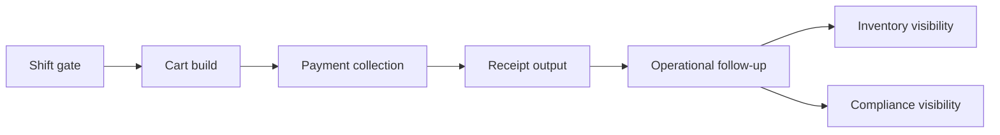
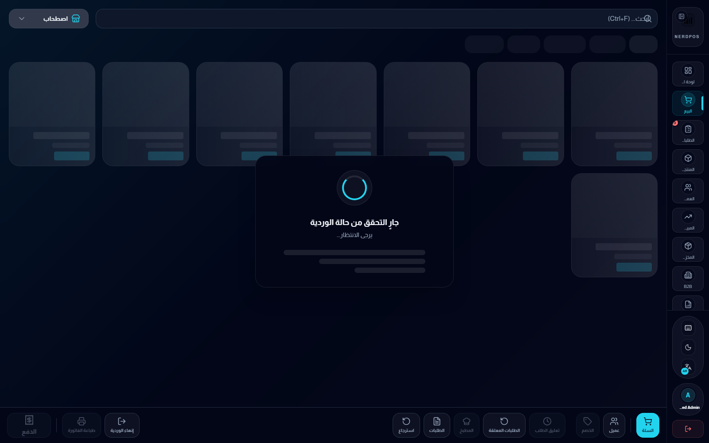
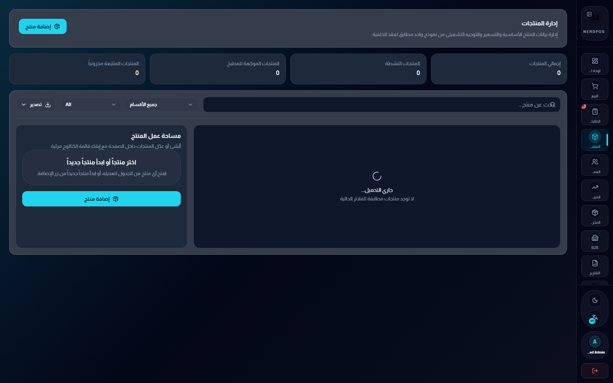
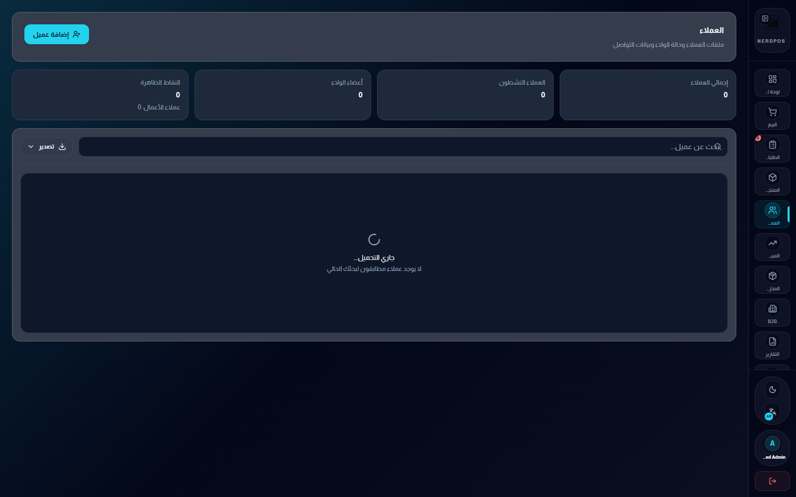

# NerdPOS Showcase

Public-safe case study for an Arabic-first POS and operations product direction.

This repo is intentionally organized as a recruiter-friendly proof layer. It shows real frontend screenshots, product workflow shape, and system boundaries without exposing private backend logic, production data, or customer-specific implementation details.

## Supporting docs

- [Workflow notes](docs/workflow-notes.md)
- [Public release notes](docs/public-release-notes.md)

## What this repo demonstrates

- cashier session gating and shift-opening flow
- live cart building inside the selling surface
- payment collection and receipt output
- adjacent operational modules for products, customers, inventory, and compliance
- Arabic-first navigation and operator-oriented workspace design

## Product framing

NerdPOS is aimed at the operational problems that usually make POS systems feel fragmented:

- checkout is often optimized for speed but disconnected from the rest of the business workflow
- receipt and compliance steps are treated as afterthoughts
- inventory visibility lives in a different world from daily selling activity
- Arabic business environments are frequently localized late instead of designed as first-class surfaces

The public layer here is meant to show that the product direction is workflow-oriented, not just screen-oriented.

## Operator journey

## Surface map

| Surface | Why it exists |
| --- | --- |
| Session gateway | Start the operator flow with shift validation instead of dropping straight into selling |
| Live POS | Product selection, quantities, totals, and cart state in one working surface |
| Payment flow | Turn checkout into a controlled step rather than a disconnected popup |
| Receipt output | Keep totals, payment method, QR, and invoice framing inside the same transaction story |
| Products and customers | Treat the POS as part of a wider operations system, not an isolated screen |
| Inventory and compliance | Show that the selling surface has operational neighbors that matter to real teams |

## Screenshot walkthrough

<table>
  <tr>
    <td width="50%" valign="top">
      
       
      <strong>1. Session gateway</strong>
       
      The public proof starts before checkout. This screen shows that the POS flow is gated by session state and operator readiness, which is more realistic than a generic demo that drops straight into product cards.
    </td>
    <td width="50%" valign="top">
      
       
      <strong>2. Live checkout surface</strong>
       
      This is the strongest evidence in the repo: a real order-building state with item cards, cart contents, quantities, pricing, tax, and a visible transition toward payment.
    </td>
  </tr>
  <tr>
    <td width="50%" valign="top">
      
       
      <strong>3. Payment collection</strong>
       
      Payment is shown as a dedicated step inside the transaction flow. That matters because it signals that the product direction handles checkout as a sequence, not just a single static page.
    </td>
    <td width="50%" valign="top">
      
       
      <strong>4. Receipt output</strong>
       
      Receipt review keeps totals, tax, payment method, and QR or invoice framing visible in the same operational thread. This is where public proof starts to connect UX directly to compliance and records.
    </td>
  </tr>
  <tr>
    <td width="50%" valign="top">
      
       
      <strong>5. Products module shell</strong>
       
      Even outside checkout, the system keeps the same operator shell and module rhythm. The products surface signals CRUD operations, categorization, search, and admin handoff inside the same product family.
    </td>
    <td width="50%" valign="top">
      
       
      <strong>6. Customers module shell</strong>
       
      The customer surface shows that the product direction is not limited to the cashier lane. It extends into customer records and relationship context, which is typical of broader business software rather than a narrow kiosk app.
    </td>
  </tr>
  <tr>
    <td width="50%" valign="top">
      
       
      <strong>7. Inventory visibility</strong>
       
      Inventory is where the public case study starts proving wider operational depth. Stock visibility, statuses, cost and price columns, and action controls all show that selling activity is connected to inventory reality.
    </td>
    <td width="50%" valign="top">
      
       
      <strong>8. Compliance-facing surface</strong>
       
      The compliance module matters because it shows the POS direction was designed with invoice and regulatory follow-up in mind, instead of bolting those needs on later.
    </td>
  </tr>
</table>

## What the screenshots prove

- the product has a real transaction narrative from shift gate to receipt output
- checkout is integrated with the broader workspace shell instead of behaving like an isolated demo
- adjacent modules exist for products, customers, inventory, and compliance
- Arabic-first handling is part of the system identity rather than a late translation pass
- the public layer can demonstrate operational depth without publishing raw private code

## Why these screenshots matter more than raw code here

For business software, public source code is not always the strongest or safest proof. A better public signal is often:

- real interface evidence
- clear workflow explanation
- explicit system boundaries
- honest claims about what is public and what is private

That is the purpose of this repo.

## Public vs private boundary

Public here:

- real frontend screenshots from a safe local copy
- product framing
- workflow diagrams
- case-study explanation

Private by design:

- production backend logic
- customer-specific workflows
- operational and financial data
- sensitive business rules and integrations

## What can be added later

Future public-safe additions can include:

- a sanitized architecture map for POS, inventory, and compliance boundaries
- more curated route captures once additional modules are stable enough for public presentation
- deeper notes on reporting, inventory handoff, and operational state management

## Related surfaces

- Main profile: [KareemQabil](https://github.com/KareemQabil)
- Portfolio: [kerimqabil.me](https://kerimqabil.me)
